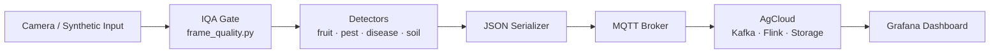

# robo-greeno-data-b

Data Team B builds the computer vision pipeline for Robo-Greeno, a robotic platform for greenhouse agriculture. The system captures camera frames from an edge device (Raspberry Pi), gates them through image quality checks, runs detection and classification models for fruit ripeness, pest presence, soil condition, and plant disease, and publishes structured results via MQTT to the AgCloud platform for storage and visualization. The guiding methodology is **end-to-end-first with stubs**: the full pipeline runs by Sprint 2 with mock components, and each subsequent sprint swaps in real models — so the system is always demoable and integration bugs surface early.

